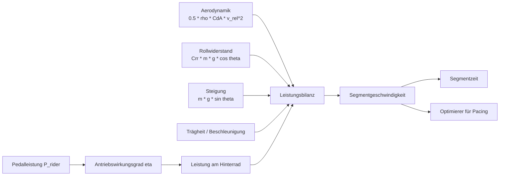
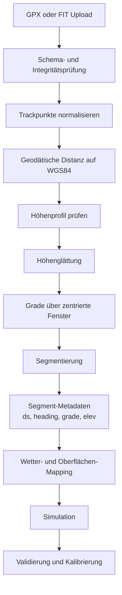
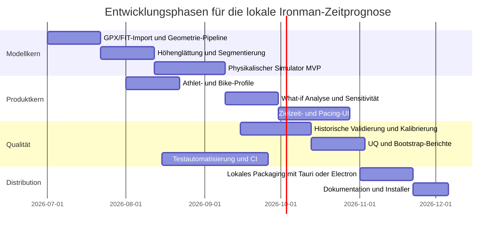

# Forschungs- und Umsetzungsbericht für eine lokale Webanwendung zur Ironman-Radzeitprognose

## Executive Summary

Eine lokale Webanwendung, die die **Kernfunktionalität von BestBikeSplit** für die Prognose von Ironman-Radzeiten repliziert, ist technisch gut realisierbar, **wenn der Fokus auf einem sauberen, physikalisch fundierten Kernmodell liegt** und proprietäre Komfortfunktionen erst nachgelagert implementiert werden. Die öffentliche Dokumentation von BestBikeSplit zeigt, dass der sichtbare Kern aus vier Bausteinen besteht: **Kursimport und Segmentierung**, **fahrer- und radbezogene Profile**, **wetter- und oberflächenabhängige Simulation** sowie **zielorientierte Pacing-Modelle** mit segmentweiser Ausgabe von Zeit, Geschwindigkeit, Leistung und Umgebungsparametern. Öffentlich dokumentiert sind u. a. GPX/FIT-Kursupload, historische und prognostische Wetterintegration, CdA-/Crr-/Gewichts-What-if-Analysen, automatische Climberkennung, Vergleich von Soll- und Ist-Daten sowie drei Optimierungsmodi auf Basis von Ziellast, Zielzeit oder TSS. Die API-Dokumentation zeigt außerdem die wesentlichen Eingabefelder: Fahrergewicht, Körpergröße, FTP, Bikegewicht, Rad- und Reifenparameter, Antriebsverluste, Crr, yaw-abhängige CdA-Werte, Wetter, Oberflächenkategorie und segmentweise Resultate. citeturn27view2turn27view3turn35view0turn34view0turn33view1turn33view3

Für eine **Ironman-spezifische Erstversion** ist kein vollständiger Nachbau des gesamten BestBikeSplit-Ökosystems nötig. Der sinnvollste Modellkern ist ein **quasi-stationäres Leistungsbilanzmodell nach Martin/Olds**, erweitert um **windrichtungsabhängige Relativgeschwindigkeit**, **streckenabhängige Steigung**, **rollenden Widerstand**, **Antriebswirkungsgrad** und optional **positionsabhängige CdA-Umschaltung** zwischen Race- und Kletterposition. Dieses Modell ist in der Literatur und in späteren Arbeiten aus dem Umfeld der Universität Konstanz als Stand der Technik für Straßensimulation und Pacing beschrieben; es ist deutlich robuster und implementierbarer als ein vollwertiges physiologisches oder CFD-gestütztes Modell, aber wesentlich belastbarer als reine Regressions- oder Pace-Tabellenmodelle. Für Solo-Ironman ist die Annahme **„Drafting vernachlässigbar“** sachgerecht, auch weil IRONMAN-Regeln Nicht-Drafting explizit durch Mindestabstand und Überholzeit erzwingen. citeturn15view0turn4search13turn25view3turn8search9turn19search9

Die größte praktische Fehlerquelle liegt **nicht** im Grundgesetz der Physik, sondern in den **Eingabedaten**: ungenaue Höhenprofile, schlecht geglättete Steigung, falsch geschätztes CdA, fehlende Wetterdaten und inkonsistente Reifen-/Oberflächenannahmen. BestBikeSplit weist selbst darauf hin, dass die Qualität von GPX/FIT und besonders der Höheninformationen modellkritisch ist und empfiehlt barometrisch saubere Geräte bzw. hochwertige Datenquellen. Die Forschung zur Steigungsrekonstruktion bestätigt, dass die naive Differentiation verrauschter Höhenprofile zu unrealistischen Gradienten führt; belastbare Ergebnisse entstehen erst mit Glättung und/oder der Kombination von Höhe, Geschwindigkeit und Leistung. citeturn3view0turn25view0turn26view2turn26view0

Architektonisch ist wegen der **nicht spezifizierten Zielplattform** und des **offen gelassenen Nutzerumfangs** ein **web-first, local-first** Ansatz am sinnvollsten: Frontend als moderne SPA, Backend lokal auf `localhost`, Speicherung lokal in SQLite, optional browserseitiger Cache via IndexedDB; für Desktop-Verteilung bieten sich **Tauri** oder **Electron** an, während eine reine PWA als leichtgewichtigste Variante zwar offlinefähig ist, aber auf Desktop-Browsern nicht überall gleich gut installierbar ist. Für ein Einzelnutzer- oder Kleinteamszenario ist keine Cloud erforderlich; das verbessert Datenschutz, Reproduzierbarkeit und Betriebskosten erheblich. citeturn11search0turn11search8turn10search3turn10search1turn10search17turn10search5turn21search3

Die empfohlene Umsetzungsstrategie ist deshalb: **zuerst ein Minimalmodell mit sauberer Route-Pipeline und Kalibrierbarkeit**, dann **Unsicherheit/Validierung**, danach **segmentweiser Pacing-Optimierer** und erst später optionale Komfortfunktionen wie Wetter-Autofetch, Geräteintegration oder Desktop-Packaging. Für das MVP reicht ein Satz von Gleichungen, zwei CdA-Zuständen, ein Crr-Surface-Mapping, Wetter als zeit-/ortsabhängige Eingabe und eine systematische Validierung an historischen Fahrdateien und offiziellen Kurs-/Ergebnisdaten. citeturn27view0turn35view0turn31search0turn31search1turn8search1turn8search4

## Markt- und Funktionsanalyse von BestBikeSplit

Die öffentlich sichtbare Produktoberfläche von BestBikeSplit zeigt, dass der Nutzen nicht nur in einer einzigen Rennzeitberechnung liegt, sondern in einem **zusammenhängenden Datensystem aus Profilen, Kursen, Wetter und Analytik**. Zu den offiziell genannten Funktionen gehören ein **Analytics Tool** mit CdA-Schätzung, Yaw- und Steigungsanalyse, ein **Comparison Tool**, ein **Time Analysis Tool** für What-if-Simulationen auf Basis von Leistung, Drag, Gewicht und Crr, ein **Power Target Model**, ein **Goal Time Model**, ein **Training Stress Score Model**, **Advanced Weather**, **Advanced Surface Conditions**, **Automatic Climb Detection** und Export-/Navigationsfunktionen für Trainings- und Headunit-Workflows. Das ist wichtig, weil es zeigt, welche Kernobjekte eine lokale Alternative ebenfalls modellieren muss. citeturn27view1turn27view2turn27view3turn1view4

Besonders aufschlussreich ist die öffentliche API. Sie dokumentiert, dass BBS für den Athleten unter anderem **Gewicht, Größe und FTP** nutzt und für das Bike **Gewicht, Komponentenklasse, Helmtyp, Vorder-/Hinterradtiefe und -breite, Reifen-/Schlauchtyp, mechanische Verluste, Rollwiderstand und yaw-abhängige CdA-Werte** speichert. Für Race-Pläne sind außerdem **Wettertyp**, **Temperatur**, **Feuchte**, **Windgeschwindigkeit**, **Windrichtung**, **Luftdruck**, **road_type**, **course_terrain**, **surface_type**, **max_watt**, **climb_speed**, **max_speed**, **minimum_vi** und die Modellart (NP, Goal Time, TSS) öffentlich dokumentiert. Die API-Antworten enthalten segmentweise **Distanz, Richtung, Steigung, Zeit, Leistung, Prozent-FTP, Yaw-Winkel, Drag-Effekt, Wind-Effekt, Luftdichte und Rollwiderstand**. Damit ist die Struktur eines interoperablen Datenmodells praktisch offen sichtbar. citeturn33view0turn33view1turn33view2turn33view3turn34view0turn35view0

Für die Zielarchitektur der lokalen Anwendung lassen sich daraus drei direkte Konsequenzen ableiten. Erstens braucht man **separate Domänenmodelle** für `AthleteProfile`, `BikeProfile`, `Route`, `WeatherProfile`, `SimulationRun` und `ValidationRun`. Zweitens sollte die Simulation **segmentorientiert** aufgebaut sein, weil genau dort sich Zeit, Wind, Yaw, Steigung und Positionswechsel sauber abbilden lassen. Drittens lohnt sich eine strikte Trennung zwischen **MVP-Kern** und **BBS-spezifischen Komfortmustern**: Ein lokales Tool muss nicht von Anfang an Workout-Sync, Headunit-Exports und TSS-Modelle replizieren, wenn das eigentliche Produktziel zunächst die **zuverlässige Ironman-Zeitprognose** ist. Diese Priorisierung ist umso sinnvoller, weil Ihre Anforderungen Ziel-OS, erwartete Nutzerzahl und Telemetrieintegration ausdrücklich offenlassen. citeturn35view0turn34view0turn27view2turn27view3

Öffentlich dokumentiert ist bei BBS außerdem die **Kalibrierlogik für CdA**: vergangene Wettkampf- oder Trainingsfahrt auf identischem Setup laden, historische Wetterbedingungen wählen, reale Leistung und tatsächliche Zielzeit gegen das Modell matchen und den Drag-Regler so anpassen, bis Modellzeit und Ist-Zeit zusammenfallen. Genau dieses Verfahren ist für eine lokale Alternative hoch relevant, weil es zeigt, dass ein praxistaugliches Produkt **nicht nur Vorhersage**, sondern auch **Rückkalibrierung** benötigt. Diese Rückkalibrierung ist einer der größten Hebel, um aus einem generischen Physikmodell ein individuelles Athletenmodell zu machen. citeturn27view0turn27view1

Nicht zuletzt enthält die Dokumentation auch Hinweise auf Funktionen, die **bewusst nicht in Phase eins** priorisiert werden sollten. BBS integriert Wahoo, Garmin-/TCX-Powerrouten und strukturierte Workouts; das ist produktseitig wertvoll, aber technisch deutlich aufwändiger und ohne Spezifikation Ihrer Telemetrieziele derzeit nicht der richtige Startpunkt. Für eine lokale Ironman-Planungsanwendung ist der größere Nutzen zunächst ein belastbarer Rechenkern, der GPX importiert, Parameter editierbar macht und segmentweise Pace-/Power-Empfehlungen erzeugt. citeturn27view2turn27view3turn1view3

| Vergleich vorhandener Funktionsmuster | Relevanz für die lokale Ironman-App | Empfehlung |
|---|---|---|
| Kursupload aus GPX/FIT und kursbezogene Berechnung | Absolut zentral; Basis aller Simulationen | **Sofort ins MVP** |
| Fahrer- und Bike-Profile mit FTP, Gewicht, CdA, Crr | Absolut zentral; zentrale Quellen der Modellparameter | **Sofort ins MVP** |
| Wetter nach Ort und Zeit entlang des Kurses | Für Ironman sehr wichtig, vor allem bei Windkursen | **Phase eins, aber zunächst optional manuell + CSV/API** |
| Time Analysis mit What-if für Power/Drag/Gewicht/Crr | Sehr hoher Nutzen für Training und Equipment-Entscheidungen | **Sofort nach Basissimulator** |
| Zielzeit-/TSS-/NP-Modelle | Nützlich, aber nicht alle gleich früh nötig | **Zielzeit + konstante/segmentierte Leistung früh; TSS später** |
| Headunit-/Workout-Export | Höherer Integrationsaufwand, unklare Priorität | **Später** |
| Live-Telemetrie und Gerätesteuerung | Anforderungen offen, daher hoher Unsicherheitsgrad | **Nicht MVP** |

*Quellenbasis der Vergleichstabelle:* öffentliche BBS-Feature- und API-Dokumentation. citeturn27view1turn27view2turn27view3turn35view0turn34view0

## Modellgrundlage und Eingabedaten

Die tragfähige mathematische Grundlage ist ein **Leistungsbilanzmodell**, bei dem die am Antrieb bereitgestellte Leistung gegen die Summe der Widerstandsleistungen bilanziert wird. Martin et al. beschreiben als relevante Terme **Aerodynamik**, **Rollwiderstand**, **Lager-/mechanische Verluste**, **Änderung potenzieller Energie** und **Änderung kinetischer Energie**; Olds et al. formulierten bereits zuvor ein First-Principles-Modell für Straßenradsportleistung. Die Konstanzer Arbeiten von Dahmen/Wolf/Saupe ordnen Martin explizit als den weiterhin maßgeblichen state of the art für Straßensimulationsmodelle ein. citeturn15view0turn4search13turn26view2

Für Solo-Ironman genügt in der Praxis ein **quasi-stationärer Segmentansatz** mit optionalem Trägheitsterm. Die Eisenbahn- oder CFD-Komplexität ist unnötig; wichtiger ist, dass die Modellgleichungen stabil, kalibrierbar und segmentweise optimierbar sind. Gleichzeitig ist es sachlich richtig, Drafting zu ignorieren, weil IRONMAN-Rennen Nicht-Drafting vorschreiben und ein Mindestabstand von 12 Metern sowie ein begrenztes Überholfenster geregelt sind. Für einen Solo-Athleten ist damit die dominante Physik genau die aus CdA, Crr, Masse, Steigung und Wind. citeturn8search9turn15view0turn25view3

Die empfehlenswerte Kernformulierung lautet für jedes Segment \(i\):

\[
P_{\text{rider},i}\,\eta
=
v_i \left(
F_{\text{aero},i}
+
F_{\text{roll},i}
+
F_{\text{grav},i}
+
F_{\text{bear},i}
\right)
+
m\,v_i\,\frac{dv}{ds}\,v_i
\]

mit

\[
F_{\text{aero}}=\frac12 \rho \, C_dA(\psi)\, v_{\text{rel}}^2,
\qquad
F_{\text{roll}}=C_{rr}\,m\,g\,\cos\theta,
\qquad
F_{\text{grav}}=m\,g\,\sin\theta
\]

und

\[
v_{\text{rel}} = \|\vec v_{\text{ground}}-\vec v_{\text{wind}}\|,
\qquad
\psi = \text{Yaw-Winkel}
\]

sowie \(\eta\) als Antriebswirkungsgrad. Martin zeigt die grundlegenden Widerstandsterme explizit; BestBikeSplit dokumentiert zusätzlich yaw-spezifische CdA-Werte, segmentweise Luftdichte, Windeffekte und Rollwiderstände in seinen API-Schemas. Für das MVP kann \(F_{\text{bear}}\) in \(\eta\) absorbiert werden; für spätere Versionen ist ein kleiner linearer Zusatzterm möglich. citeturn15view0turn16view0turn33view1turn35view0

Die Modellkomponenten lassen sich so verstehen:

Die wichtigste Modellentscheidung betrifft die **Parametrisierung von CdA**. Offizielle BBS-Dokumentation und Blogmaterial zeigen, dass CdA dort über **Yaw-Knoten** und getrennt nach Race- und Kletterposition geführt wird. Für ein lokales Ironman-Tool ist eine drei­stufige Strategie sinnvoll: zuerst **ein einziges CdA\_race**, dann **zwei Zustände** (`CdA_race`, `CdA_climb`), danach optional **yaw-abhängige Interpolation** über Knoten bei 0°, 5°, 10°, 15° und 20°. Das ist deutlich realistischer als ein einzelner globaler CdA-Wert, aber wesentlich einfacher als CFD. Offiziell nennt BBS für Age-Group-Triathlonpositionen typische Größenordnungen von etwa **0,25–0,30 m²**, während aufrechte Straßenpositionen deutlich höher liegen. Diese Werte sind als **Initialheuristik**, nicht als Endkalibrierung zu verstehen. citeturn33view1turn36view0

Für die physiologische Seite sollte das MVP **FTP-kompatibel**, aber **CP-fähig** entworfen werden. FTP ist in BBS und in der Trainingspraxis weit verbreitet und wird dort direkt in Profil und Modellierung verwendet. Die Forschung weist jedoch darauf hin, dass FTP wissenschaftlich schwächer abgesichert ist als Critical Power; Karsten berichtet, dass FTP und CP auf Gruppenebene ähnlich sein können, für Individuen aber nicht austauschbar sind, mit deutlichen Limits of Agreement. Der robustere Langfristpfad ist deshalb: im MVP Eingabe von **FTP oder CP**, intern einheitliche Normalisierung, und ab Phase zwei optional ein **CP/W′-Constraint** für Pacing über langwellige oder hügelige Segmente. citeturn33view0turn34view0turn29view1turn30search3

Die folgende Modellvergleichstabelle ist für Ihre Produktentscheidung zentral:

| Kandidatenmodell | Beschreibung | Stärken | Schwächen | Eignung für lokale Ironman-App | Empfehlung | Quellen |
|---|---|---|---|---|---|---|
| Quasi-stationäres Leistungsbilanzmodell | Segmentweise Bilanz aus Aero, Roll, Steigung, optional Trägheit | Sehr gut kalibrierbar, robuste Physik, gut verständlich | Qualität hängt stark an CdA/Crr/Wetter/Höhe | Sehr hoch | **Primärmodell für MVP** | citeturn15view0turn4search13turn26view2 |
| Dynamisches ODE-Modell mit expliziter Beschleunigung | Kontinuierliche Bewegungsgleichung mit Beschleunigung/Verzögerung | Realistischer bei Kuppen, Richtungswechseln, Stopp/Go | Höherer Implementierungs- und Optimierungsaufwand | Mittel bis hoch | **Phase zwei** | citeturn19search24turn25view3 |
| Reines Regressions-/Heuristikmodell | Zeit nur aus Historie/ähnlichen Kursen abgeleitet | Sehr schnell, wenig Parameter | Schlechte Generalisierung auf Wetter/Equipment | Niedrig | **Nicht empfehlenswert als Kernmodell** | citeturn15view0turn4search13 |
| Physik + CP/W′-Constraint | Mechanisches Modell plus metabolische Obergrenzen | Besseres Pacing, realistischer bei variabler Leistung | Mehr Tests/Kalibrierung nötig | Hoch für spätere Optimierung | **Ab Phase zwei/ drei** | citeturn30search3turn29view1turn19search1 |
| CFD-/Windtunnel-gestütztes High-End-Modell | Sehr detaillierte Aero-Parametrisierung über Yaw/Equipment | Hohe Detailtiefe | Für lokales Produkt zu teuer und datenhungrig | Niedrig für Standardnutzer | **Nur als externe Kalibrieroption** | citeturn29view3turn14search17 |

Die **erforderlichen Eingabedaten** für eine belastbare Ironman-Prognose sind damit klar: **GPX-/FIT-Kurs**, **Fahrergewicht**, **Größe/Anthropometrie**, **FTP oder CP**, **Bikegewicht**, **Wheel-/Tyre-Set-up**, **reibungsrelevante Reifen-/Oberflächenannahmen**, **CdA-Startwert** sowie **Wetter** mindestens als Temperatur, Druck, Humidität und Windvektor. BBS dokumentiert genau diese breite Eingabestruktur öffentlich; zusätzlich empfiehlt die Forschung Fotomethoden bzw. anthropometrisch gestützte Schätzungen, um die Stirnfläche als CdA-Vorstufe zu nähern. PubMed-Abstracts zu Debraux/Heil zeigen, dass projected frontal area und deren Bestimmung aus Foto-/Anthropometriedaten eine sinnvolle Ausgangsbasis sind, wenn kein direkter Feldtest vorliegt. citeturn33view0turn33view1turn34view0turn37search0turn37search9turn29view3

Für die **Minimalparameterisierung** empfehle ich folgende Initialwerte, die später zwingend kalibriert werden sollten:

| Minimaler Modellparameter | Empfohlener Startwert | Bemerkung |
|---|---:|---|
| `CdA_race` | 0,28 m² | Mitte der von BBS genannten Age-Group-Tri-Ranges |
| `CdA_climb` | 0,32 m² | konservativer, aufrechterer Kletterwert |
| `Crr` | 0,0040 | brauchbarer Asphalt-Startwert |
| `eta` | 0,975 | entspricht 2,5 % Antriebsverlust |
| `humidity` | 60 % | sinnvoller Standard, falls keine Wetterdaten vorliegen |
| `pressure` | 1013,25 hPa | Standarddruck |
| `position_switch_speed` | 24 km/h | Wechsel Race/Kletterposition als Startheuristik |
| `wind` | 0 m/s | nur als Notfall-Default, nicht für reale Race-Pläne |

*Quellenbasis und Einordnung:* BBS-API-Defaults nennen `rolling_resistance` 0,004 und `mechanical_loss` 0,03 als Defaults; die Bike-Samplewerte zeigen 0,025 mechanischen Verlust und getrennte Race-/Climb-CdA-Schemata, während der BBS-Blog für Age-Group-Triathleten CdA-Ranges von 0,25–0,30 m² nennt. Die exakten Startwerte oben sind daher eine **abgeleitete Engineering-Empfehlung**, keine Naturkonstante. citeturn33view1turn33view2turn36view0turn34view0

## Datenformate und Vorverarbeitung

Das primäre Austauschformat für Strecken sollte **GPX 1.1** sein. Die offizielle Topografix-Spezifikation beschreibt GPX als XML-Schema mit `metadata`, `wpt`, `rte` und insbesondere `trk`/`trkseg`/`trkpt`; für Ihre Anwendung ist `trkpt` mit `lat`, `lon` und möglichst `ele` die relevante Einheit. GPX ist offen und breit interoperabel, was es für eine lokale Anwendung als Standardformat ideal macht. citeturn6search0turn6search9

Für die Datenbeschaffung sind **Strava**, **Garmin Connect**, **RideWithGPS** und eigene Dateien der Nutzer die sinnvollsten Praxisquellen. Strava dokumentiert offiziell den GPX-Export aus Aktivitäten und weist darauf hin, dass exportierte GPX-Dateien **leistungs­messerspezifische Powerdaten enthalten, wenn diese aufgezeichnet wurden, aber keine geschätzte Leistung**. BestBikeSplit empfiehlt seinerseits ausdrücklich hochwertige GPX/FIT-Dateien und stuft Datenquellen ohne brauchbare Höhenmessung – etwa Telefon-Apps oder GPS-Geräte ohne Altimeter – als problematisch ein. Für ein lokales Tool bedeutet das: Import ja, aber **mit Qualitätsprüfung und Warnsystem**. citeturn6search17turn3view0

Für Ironman-Kurse sollten **offizielle Veranstalterprofile** priorisiert, aber nicht blind übernommen werden. Die offizielle IRONMAN-Frankfurt-Seite beschreibt den Bike Course als **180 km, rolling**, und die zugehörigen Kursunterlagen weisen ausdrücklich darauf hin, dass die Karten Änderungen unterliegen; ein offizielles Bike-PDF nennt zudem beispielhaft **178 km und 1100 Höhenmeter** für eine konkrete Kursversion. Praktisch folgt daraus: Jeder Kursdatensatz in der lokalen Anwendung braucht **Versionierung**, **Quelle**, **Importdatum** und idealerweise eine **„Organizer says / user verified“-Kennzeichnung**. citeturn8search1turn8search5

Die Distanzberechnung zwischen Trackpunkten sollte nicht mit einer einfachen planaren Näherung erfolgen, sondern mit einer **ellipsoidischen Geodäsie** auf WGS84. GeographicLib dokumentiert explizit robuste geodesische Berechnungen auf dem Ellipsoid und ist dafür in der Praxis ein exzellenter Unterbau. Für eine lokale App ist das wichtig, weil Distanzfehler in 180-km-Kursen direkt auf Gradient, Geschwindigkeit und kumulierte Fahrzeit durchschlagen. citeturn23search0turn23search1turn23search7

Die Vorverarbeitung sollte als deterministische Pipeline implementiert werden:

Gerade das **Höhenprofil** verdient besondere Sorgfalt. Forschung aus Konstanz zeigt, dass Steigungsprofile aus verrauschten Höhenmessungen nur nach Glättung sinnvoll sind; untersucht wurden u. a. **Gaussian Filter**, **Savitzky–Golay**, **Tikhonov-Regularisierung** und modellgestützte Verfahren unter Einbeziehung von Leistung und Geschwindigkeit. Gleichzeitig zeigt Menaspà, dass barometrische Geräte unter trockenen Bedingungen recht brauchbare Gesamtanstiege liefern, sich aber bei nassem Wetter deutlich verschlechtern können. Garmin weist für barometrische Altimeter auf typische Genauigkeitsgrenzen hin, und RideWithGPS erläutert, dass geplante Routen auf interpolierten Höhendatensätzen basieren und daher systematische Unterschiede aufweisen können. Für Ihr Projekt ist daraus die klare Schlussfolgerung: **Höhendaten nie roh differenzieren**, sondern immer validieren und glätten. citeturn25view0turn26view2turn25view1turn26view0turn18search11turn18search15

Konkret empfehle ich für das MVP folgende Preprocessing-Regeln als belastbaren Standard: erstens **Resampling auf 10–25 m**, zweitens **Savitzky–Golay oder Gaussian smoothing** des Höhenprofils, drittens **Grade-Berechnung über ein zentriertes Fenster von 25–75 m**, viertens **Entfernung pathologischer Spikes** und fünftens **Segmentreduktion** für den Simulator auf etwa 25–100 m, sofern dadurch keine relevanten Steigungs- oder Richtungswechsel verloren gehen. Diese Parameter sind eine Engineering-Ableitung aus der zitierten Höhen- und Steigungsliteratur sowie aus der BBS-Idee des optionalen `seg_reducer`. citeturn25view0turn26view2turn34view0

Auch die **Wetterdaten** müssen entlang der Route räumlich und zeitlich gemappt werden. BBS dokumentiert Wettermodi mit einem Einzelpunkt-Weather, einem automatisch entlang des Kurses gezogenen **12-Punkte-Advanced-Weather** und einem stündlichen Verlauf. Für eine lokale App ist ein stufenweiser Ansatz sinnvoll: manuelle Wetterwerte im MVP, danach streckenabhängiger Abruf aus offenen Quellen. In Deutschland ist der DWD mit offenen Daten und einer API-Dokumentation eine naheliegende Primärquelle; alternativ bietet Open-Meteo offene Wetter- und Historikdaten mit dokumentierter Attribution-Lizenz und modellgestützter Ortszeitreihe. citeturn3view1turn34view0turn9search1turn9search3turn9search2turn9search13

Die folgende Priorisierung der Datenquellen ist für die Produktqualität entscheidend:

| Datenquelle | Liefert | Stärke | Risiko / Einschränkung | Priorität | Quellen |
|---|---|---|---|---|---|
| Offizielle Kursprofile und Veranstalterunterlagen | Distanz, Streckenführung, offizielle Version | höchste rechtliche und organisatorische Nähe zum Event | Karten können sich ändern; oft keine maschinenlesbaren Tracks | **Sehr hoch** | citeturn8search1turn8search5 |
| Eigene FIT-/GPX-Dateien mit barometrischem Gerät | reale Strecke, reale Leistung, reale Höhe | ideal für Kalibrierung und Validierung | Datenqualität geräteabhängig | **Sehr hoch** | citeturn3view0turn25view1turn18search11 |
| Strava-Export | GPX, ggf. gemessene Leistung | sehr zugänglich, gute Nutzerakzeptanz | Power nur bei Powermeter; Höhenqualität variiert | **Hoch** | citeturn6search17turn3view0 |
| GoldenCheetah | Dateiimport, Analyseumgebung, offene Tools | stark für Nachanalyse und Kalibrierworkflows | nicht primäre Kursquelle | **Hoch** | citeturn6search1turn7search3turn7search4 |
| Herstellerdaten | Bikegewicht, Geometrie, Laufrad-/Reifenspezifikationen | gut für feste physische Eingaben | oft keine direkten Crr-/CdA-Werte | **Hoch** | citeturn24search0turn24search6turn22search6turn22search3 |
| DWD / Open-Meteo | Wetter historisch/prognostisch | wichtig für Wind/Luftdichte | Lizenz- und Abdeckungsdetails prüfen | **Mittel bis hoch** | citeturn9search1turn9search3turn9search2turn9search13 |
| Crowd-/DEM-Höhendaten | korrigierte Höhe, Lückenfüllung | nützlich als Fallback | Brücken, Dämme und Fehlzuordnung problematisch | **Mittel** | citeturn18search1turn18search21 |

## Kalibrierung, Unsicherheit und Validierung

Die beste Modellarchitektur nützt wenig ohne **Kalibrierung**. Für eine Ironman-Anwendung sind vor allem **CdA**, **Crr**, **Bike-/Systemmasse**, **Wetterabbildung** und die **Steigungsaufbereitung** identifikationskritisch. BBS’ eigene Dokumentation beschreibt ein praxisnahes CdA-Finetuning über historische Fahrten, bei dem reale Durchschnittsleistung und tatsächliche Fahrzeit gegen den Modelllauf abgeglichen werden. Das ist kein akademischer Nebenaspekt, sondern sollte Kernbestandteil Ihrer Anwendung sein: Der Nutzer muss nach einem Rennen oder einer Trainingsfahrt sein Modell **gegen Realität zurückjustieren** können. citeturn27view0turn27view1

Für **CdA** gibt es drei sinnvolle Kalibrierpfade. Der präziseste ist Windtunnel oder velodrombasierter Test; deutlich praxisnäher sind **Feldmethoden**. Debraux’ Review hält fest, dass Feldmethoden mit wenig Material validen Vergleich zum Windtunnel liefern können. Dyer et al. berichten für die **Virtual Elevation Method** eine hohe Präzision mit statistischer Korrelation zum Windtunnel, wenn auch mit systematisch abweichenden Absolutwerten. Für das lokale Produkt ist daraus die richtige Interpretation: Feldtests sind **geeignet für relative Optimierung und produktive Kalibrierung**, aber die Software sollte immer kommunizieren, dass CdA-Schätzungen **kontextabhängig** und in Absolutwerten nicht vollkommen austauschbar sind. citeturn29view3turn15view2

Für **Crr** ist eine direkte Bestimmung schwieriger. Coast-down-Verfahren liefern realistische Schätzungen, sind aber wind- und belagsensitiv. Tengattini/Bigazzi zeigen, dass Outdoor-Coast-down-Tests bei Headwind ausreichende Sensitivität besitzen, um Änderungen durch Reifendruck und Position zu erkennen, und nennen typische Schätzwerte für Asphalt. Für das Produktdesign folgt daraus: Crr sollte im MVP als **Surface × Tyre × Pressure-Heuristik** gestartet und anschließend über historische Vergleichsfahrten oder optionale Testprotokolle feinjustiert werden. Eine harte Behauptung „dieser Reifen hat exakt Crr X“ ist ohne eigenes Testlabor kaum vertretbar. citeturn15view3turn16view1turn16view2

Bei der **Unsicherheitsquantifizierung** empfehle ich zwei Ebenen. Die erste Ebene ist **parametrische Monte-Carlo-Propagation**: Ziehen von Verteilungen für CdA, Crr, Windgeschwindigkeit/-richtung, Luftdruck, Temperatur, Bikegewicht und Höhenbias und anschließende Verteilung der prognostizierten Zielzeit. Die zweite Ebene ist **globale Sensitivitätsanalyse**, vorzugsweise Sobol oder Morris, um sichtbar zu machen, welche Eingangsgrößen die Prognose dominieren. SALib dokumentiert dafür eine praktikable Workflow-Struktur, und SciPy stellt Bootstrap-Verfahren für Konfidenzintervalle von Validierungsmetriken bereit. Das ist für eine lokale App mit wissenschaftlichem Anspruch sehr wertvoll, weil der Nutzer nicht nur eine Zahl, sondern ein **Zeitintervall und Einflussränge** erhält. citeturn31search0turn31search12turn31search1turn31search8

Die **Validierung** sollte auf mindestens drei Datenebenen erfolgen. Erstens auf **Komplettrennen-Ebene**: prognostizierte Bike-Split-Zeit gegen offizielle Rennergebnisse. Zweitens auf **Segmentebene**: prognostizierte Segmentzeiten und -geschwindigkeiten gegen echte Fahrdateien. Drittens auf **Parameter-Rückprojektionsebene**: Kann ein historischer Ride mit denselben Parametern und denselben Wetterdaten plausibel rekonstruiert werden? Offizielle IRONMAN-Ergebnisse liefern die Zeit-„Ground Truth“, persönliche FIT-/GPX-Dateien liefern den physikalischen Detailvergleich. citeturn8search4turn3view0turn35view0

Die sinnvollen Metriken sind dabei klassische Regressionsmaße plus fachliche Kennzahlen:

| Metrik | Definition / Bedeutung | Warum relevant | Empfehlung im Projekt | Quellen |
|---|---|---|---|---|
| Absolute Zielzeitabweichung | \(|t_{\text{pred}}-t_{\text{real}}|\) | direkt verständlich für Athleten | Primäre KPI | fachliche Projektempfehlung |
| MAE | mittlere absolute Fehler | robust interpretierbar, gleiche Einheit wie Zielgröße | Standardbericht pro Datensatz | citeturn20search0 |
| RMSE | Wurzel aus MSE | bestraft Ausreißer stärker | Ergänzende KPI | citeturn20search2turn20search8 |
| Segment-MAE | mittlere absolute Abweichung pro Segment oder pro 1-km-Bin | zeigt Fehlerlokalisierung | Pflichtmetrik bei Modellverbesserung | fachliche Projektempfehlung |
| Geschwindigkeits-RMSE | Fehler in \(v\) statt in \(t\) | hilft bei Diagnostik von Wind/CdA-Problemen | sekundär | citeturn20search2turn20search8 |
| Climb-/Descent-Split-Fehler | Fehler getrennt nach Streckentyp | erkennt systematische Modellschwächen | sehr empfehlenswert | fachliche Projektempfehlung |
| Kalibrierungs-Restfehler | Abweichung im Backfit historischer Fahrten | misst Identifizierbarkeit der Parameter | Pflicht in Kalibrierungsmodul | fachliche Projektempfehlung |

Eine belastbare Minimalvalidierung für die erste produktionsnahe Version wäre aus meiner Sicht: **mindestens 20–30 historische Fahrten** auf 3–5 Kursen, darunter mindestens ein offizieller Ironman-Kurs, jeweils mit sauberer Leistungsmessung und möglichst vernünftigem Wetterbezug. Ist das nicht verfügbar, sollte der Projektplan einen **synthetischen Prüfstand** enthalten: bekannte Standardkurse, simulierte Wetterlagen und reproduzierbare GoldenCheetah-/Strava-Testdateien. GoldenCheetah ist dafür attraktiv, weil es breite Dateiimporte unterstützt und offen verfügbar ist. citeturn7search0turn7search3turn6search1turn6search17

Für die **Pacing-Optimierung** selbst spricht die Literatur dafür, variable Leistung in Abhängigkeit von Gradient und Wind zuzulassen. Atkinson et al. und Cangley et al. zeigen, dass variable Power-Strategien gegenüber konstantem Poweroutput Vorteile bringen können; die Konstanzer Arbeiten verbinden mechanisches Modell und physiologische Einschränkung explizit mit numerischer Optimierung. Für Ihre Anwendung bedeutet das: ein **per-Segment-Pacing-Optimierer** ist nicht bloß UI-Gimmick, sondern ein wissenschaftlich plausibler zweiter Ausbauschritt nach dem Basissimulator. citeturn19search9turn19search0turn25view3

## Softwarearchitektur und lokaler Produktentwurf

Da **Zielbetriebssystem, Nutzerzahl und Telemetrieintegration nicht spezifiziert** sind, ist eine **lokale, modulare Architektur mit webbasierter UI und optionalem Desktop-Shell** die risikoärmste Wahl. Für den Kern empfehle ich: **Frontend im Browser**, **lokales Backend auf `localhost`**, **Dateiimport direkt vom Dateisystem**, **persistente lokale Datenbank**, **keine Cloud-Pflicht**. Das hält die Anwendung stabil, datenschutzfreundlich und testbar. Gleichzeitig bleibt der Weg offen, später entweder im Browser, als PWA oder als Desktop-App zu verteilen. citeturn10search17turn10search7turn21search3turn10search5

Für den konkreten Stack halte ich eine Python-Backend-Variante für am sinnvollsten, weil die Modelllogik, Statistik, UQ und Optimierung dort am ergonomischsten liegen. **FastAPI** eignet sich als lokaler API-Layer sehr gut, weil es hohe Performance, automatische Validierung, starke Typisierung und automatische Dokumentation mitbringt; **Pydantic** ergänzt das sauber für Datenmodelle und Eingabevalidierung. Auf der Persistenzseite ist **SQLite** ideal für Einzelnutzer- und Local-App-Szenarien, da es ohne separaten Server auskommt, ACID-Eigenschaften bietet und die Daten plattformübergreifend in einer Datei speichert. citeturn28search0turn28search4turn28search9turn21search2turn21search20turn10search2turn10search5

Für das Frontend sind sowohl **React** als auch **SvelteKit** gut vertretbar. React punktet mit Teamverfügbarkeit und Ökosystem, SvelteKit mit einer schlankeren, sehr performanten Webapp-Struktur. Für Ihre Anforderung „lokale Webanwendung“ würde ich **SvelteKit** oder **React + Vite** empfehlen; wenn das Team klein ist und die UI stark datengetrieben sein soll, ist SvelteKit oft produktiver, während React bei größerer Bibliotheksvielfalt punktet. Diese Aussage ist eine Engineering-Empfehlung; die offiziellen Dokumentationen bestätigen bei beiden den komponentenbasierten beziehungsweise performanten App-Ansatz. citeturn11search1turn11search2turn11search18

Für die Desktop-Verpackung gibt es zwei realistische Pfade. **Electron** ist der schnellste Weg für Teams mit reinem Web-/TypeScript-Hintergrund und läuft nativ auf Windows, macOS und Linux mit einem Chromium-/Node-Unterbau. **Tauri** setzt ebenfalls auf eine Web-UI, erzeugt aber kleinere Binaries und nutzt System-Webviews statt eines eingebetteten Chromium-Stapels. Weil Ihre Ziel-OS-Anforderung offen ist, empfehle ich strategisch: **zuerst web-first entwickeln**, dann je nach Teamkompetenz **Tauri** als Standard-Packaging und **Electron** als Fallback, wenn die Rust-Hürde zu hoch ist. Eine reine **PWA** ist für Offline-Betrieb attraktiv, jedoch dokumentiert web.dev Einschränkungen bei der Desktop-Installation unter Safari und Firefox. citeturn10search3turn10search16turn11search0turn11search8turn11search20turn10search1turn10search17

Für Offline- und Dateiverhalten sollte die App zwei Schichten besitzen: **dauerhafte Fachdaten in SQLite** und **interaktive UI-/Cache-Daten in IndexedDB**. IndexedDB ist für große strukturierte clientseitige Datenmengen geeignet; die File System Access API erlaubt – je nach Browserumgebung – den direkten Zugriff auf Dateien und Verzeichnisse mit expliziter Nutzerfreigabe. In einer Desktop-Verpackung kann der Shell-Layer diesen Teil noch komfortabler machen. citeturn21search3turn21search12turn21search1turn21search13

Die Anwendungsarchitektur sollte logisch so aussehen:

| Architekturschicht | Empfohlene Rolle | Umsetzung |
|---|---|---|
| UI | GPX-Upload, Parametereditor, Charts, Szenarien | SvelteKit oder React |
| Lokale API | Simulation, Optimierung, Kalibrierung, UQ | FastAPI + Pydantic |
| Numerikkern | Physik, Wetter-Mapping, Solver | Python/NumPy/SciPy |
| Persistenz | Profile, Routenindex, Simulationsläufe | SQLite |
| Browser-Cache | UI-Status, kurzlebige Artefakte, Offline-Caches | IndexedDB |
| Desktop-Shell | Datei-Dialoge, Packaging, Systemintegration | Tauri bevorzugt, Electron alternativ |

Die Tech-Stack-Optionen lassen sich so vergleichen:

| Stack-Option | Vorteile | Nachteile | Passend wenn | Empfehlung | Quellen |
|---|---|---|---|---|---|
| SvelteKit + FastAPI + SQLite + Tauri | performant, kleine Binaries, sauber lokal, web-first | Rust/Tauri-Einstieg nötig | kleines Team, Performance und schlanke Distribution wichtig | **Beste Gesamtoption** | citeturn11search2turn28search0turn10search5turn11search0 |
| React + FastAPI + SQLite + Electron | sehr schneller Entwicklerstart, großes UI-Ökosystem | größere App-Binaries, Chromium-Ballast | Team ist stark in React/TS, Desktop zuerst | **Sichere Alternative** | citeturn11search1turn10search3turn10search5turn28search0 |
| Reine PWA + IndexedDB + optional lokales Python | null Installationsbarriere, offlinefähig | Desktop-Installationsgrenzen, Dateizugriff browserabhängig | Browserbetrieb reicht und Desktop ist sekundär | **Nur wenn Desktop zweitrangig** | citeturn10search1turn10search17turn21search3turn21search13 |

In Bezug auf **Performance und Skalierung** ist die gute Nachricht: Eine lokale Ironman-Simulation ist rechnerisch überschaubar. Die Hauptarbeit liegt in Geometrie, Wetter-Mapping und wiederholter Leistungsbilanz über einige Tausend bis Zehntausend Segmente. Für diesen Anwendungsfall ist nicht horizontale Cloud-Skalierung entscheidend, sondern **kontrollierte Vektorisierung**, **Vorberechnung segmentinvarianter Größen** und **Caching**. Für Szenariovergleiche sollte der Generator Streckengeometrie, Heading, Gradienten und Oberflächenparameter vorkompilieren, sodass bei Parameteränderungen nur noch diejenigen Terme neu gerechnet werden, die von Wetter, CdA, Crr oder Leistung abhängen. Das ist eine Engineering-Ableitung aus dem segmentierten Modell. citeturn35view0turn25view0

UI/UX-seitig sollten die ersten Screens nicht breit, sondern tief sein. Ich empfehle konkret vier zentrale Ansichten: **Kursimport**, **Athlet-/Bike-Editor**, **Simulation & Sensitivität** und **Pacing-Editor**. Der Pacing-Editor sollte bei gleicher Bedienlogik sowohl **konstante Gesamtleistung**, **Zielzeitrechnung** als auch **segmentweisen Leistungsplan** erlauben. Ergänzend sind ein **Validierungsmodus** und ein **Kalibrierungsassistent** wichtig, denn gerade im Triathlon bringt eine App nur dann Vertrauen, wenn sie Ist-Daten sichtbar gegen Soll-Modell erklärt. Diese Priorisierung folgt direkt aus den stärksten BBS-Funktionsmustern Time Analysis, Comparison und CdA-Analyse. citeturn27view1turn27view2turn27view0

Beim **Testing und CI** empfehle ich: Frontend-Unit- und Component-Tests mit **Vitest**, Backend- und Numeriktests mit **pytest**, Property-based-Tests für den Simulationskern mit **Hypothesis**, End-to-End-Tests mit **Playwright** und Automatisierung via **GitHub Actions**. Gerade der Physikkern profitiert stark von Eigenschaftstests, etwa „Zeit sinkt nicht, wenn Leistung steigt“ oder „bei gleichem Setup steigt die Zielzeit mit CdA“. Die genannten Werkzeuge sind dafür dokumentiert und gut kombinierbar. citeturn12search0turn12search1turn13search2turn13search0turn13search3turn12search2

Rechtlich ist das Projekt vor allem an vier Stellen sensibel. Erstens sollte die Anwendung **nicht unter einer verwechselbaren Bezeichnung** mit BestBikeSplit vermarktet werden; die BBS-Seiten weisen „All rights reserved“ aus und definieren den Dienst samt APIs vertraglich in ihren Nutzungsbedingungen. Zweitens sollten **keine proprietären BBS-Daten, Screens, APIs oder course assets ohne Berechtigung** genutzt oder gespiegelt werden. Drittens sind die Begriffe **Normalized Power®, Training Stress Score® und Intensity Factor®** laut BBS-Seite registrierte Marken von TrainingPeaks; wenn diese Begriffe in Produkt und UI erscheinen sollen, ist eine Lizenz- bzw. Rechtsprüfung sinnvoll. Viertens müssen offene Drittquellen wie Wetterdaten mit ihren jeweiligen **Lizenz- und Attributionspflichten** eingebunden werden. Das ist keine Rechtsberatung, aber eine klare Produktanforderung. citeturn2view0turn1view4turn2view1turn9search13

## Roadmap, MVP und nächste Schritte

Die empfohlene Roadmap ist **nicht feature-first, sondern risiko-first**. Die größte Projektrisiken sind: unzuverlässige Höhen-/Grade-Pipeline, instabiles CdA/Crr-Modell, fehlende Kalibrierbarkeit und zu frühe UI-/Packaging-Optimierung. Deshalb sollte die Umsetzung mit einem numerischen Kern beginnen, bevor Desktop-Verteilung oder Geräteschnittstellen kommen. Das ist auch deshalb sinnvoll, weil Zielplattform, Nutzerzahl und Live-Telemetrie in Ihren Anforderungen bewusst offen bleiben. citeturn25view0turn27view0turn10search1turn11search0

Die folgende Entwicklungsplanung priorisiert den wissenschaftlichen Kern und die lokale Produkttauglichkeit:

Das **Minimal Viable Model** sollte funktional sehr klar abgegrenzt sein. Es umfasst: GPX-Import, WGS84-Distanzberechnung, Höhenfilterung, Segmentierung, Eingabe von Athlet/Bike/Wetter, deterministische Simulation mit **zwei CdA-Zuständen** (`race`, `climb`), einem **Crr-Wert oder einfachen Surface-Mapping**, mechanischem Wirkungsgrad, Windprojektion entlang des Kurses, Zielzeit- und What-if-Szenarien sowie die Ausgabe von **Gesamtzeit, Segmentzeit, Segmentleistung, Segmentgeschwindigkeit und Sensitivität auf CdA/Crr/Wind**. Nicht ins MVP gehören Live-Telemetrie, Workout-/Headunit-Sync, TrainingPeaks-kompatible Metriken im Markensinn oder Desktop-spezifische Komfortfeatures. citeturn35view0turn34view0turn27view2turn27view3

Meine priorisierte Implementierungsreihenfolge wäre:

1. **Routenpipeline**: GPX/FIT-Import, Distanz, Höhe, Heading, Glättung, Segmentierung.  
2. **Physikkern**: Leistungsbilanz mit Aero, Roll, Steigung, Wind, Wirkungsgrad.  
3. **Parameter-UI**: Athlet/Bike/Wetter/Defaults.  
4. **Validierungsmodus**: historische Fahrt einlesen, Ist-/Soll-Vergleich.  
5. **Kalibrierungsassistent**: CdA und Crr aus historischer Fahrt nachjustieren.  
6. **Pacing-Optimierer**: segmentweiser Leistungsplan unter Nebenbedingungen.  
7. **Unsicherheit/Sensitivität**: Monte Carlo, Einflussränge, Konfidenzbänder.  
8. **Packaging**: Desktop-Shell oder PWA-Distribution.  

Diese Reihenfolge maximiert den wissenschaftlichen Erkenntnisgewinn pro Entwicklungswoche und reduziert das Risiko, eine optisch schöne, aber physikalisch fragwürdige Anwendung zu bauen. citeturn27view0turn31search0turn31search1turn19search9

Als **konkrete nächste Schritte** empfehle ich in unmittelbarer Priorität: erstens ein verbindliches **Datenmodell** für Route/Athlet/Bike/Wetter/Simulation zu entwerfen; zweitens einen kleinen **Benchmark-Datensatz** aus 3–5 historischen Fahrten und mindestens einem offiziellen Ironman-Kurs zusammenzustellen; drittens das MVP als **lokalen Simulator ohne Optimierer** umzusetzen; viertens früh einen **CdA-Kalibrierworkflow** einzubauen; und fünftens auf dieser Basis erst die Entscheidung **Tauri vs. Electron vs. PWA** zu finalisieren. Solange OS und Nutzerzahl nicht präzisiert sind, ist eine web-first Implementierung die beste Entscheidungsvorlage. citeturn8search1turn8search4turn6search17turn11search0turn10search3turn10search1

Wenn ich für dieses Vorhaben **eine einzige Empfehlung** priorisieren müsste, wäre es diese: **Bauen Sie zuerst einen lokal reproduzierbaren, kalibrierbaren Simulationskern mit sauberer Unsicherheitsdarstellung**. Genau dort entsteht der eigentliche Produktwert. Alles andere – Desktop-Packaging, schicke Exporte, zusätzliche Integrationen – ist wertvoll, aber sekundär. citeturn15view0turn27view0turn31search8